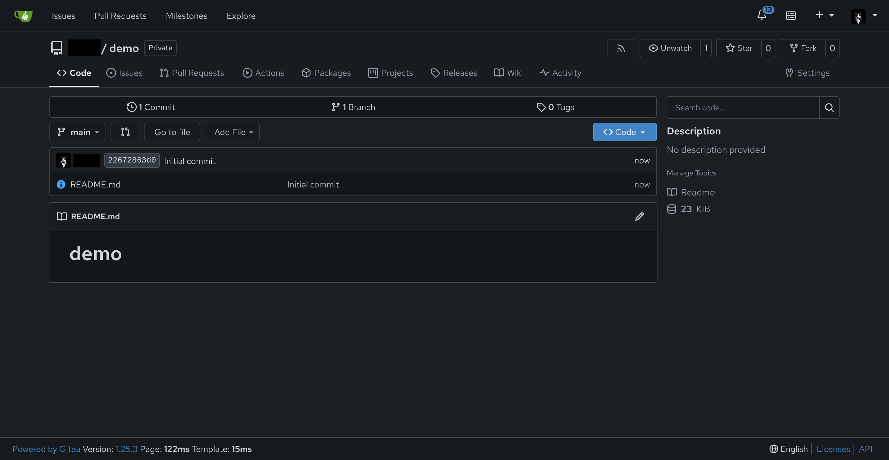
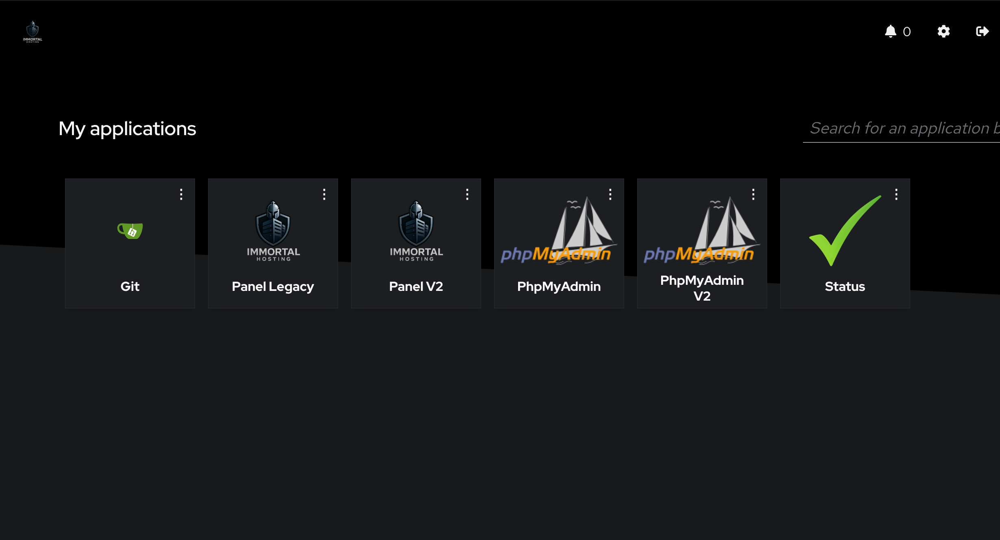
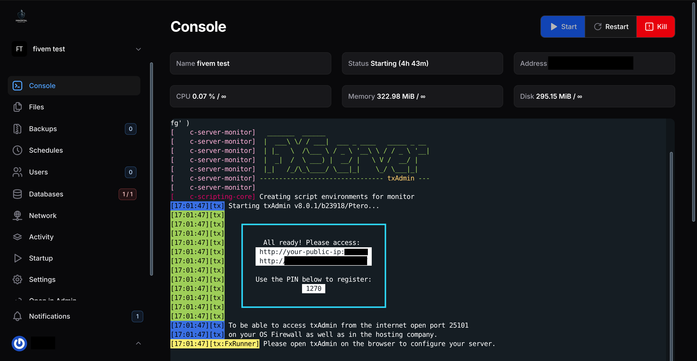
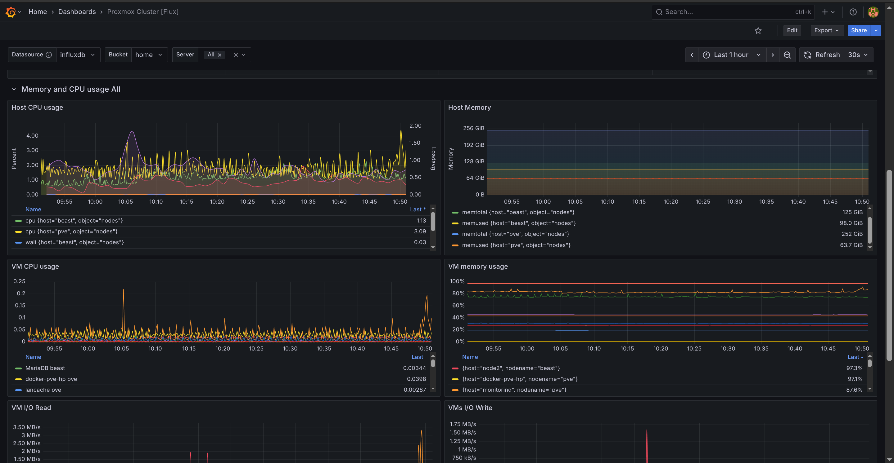
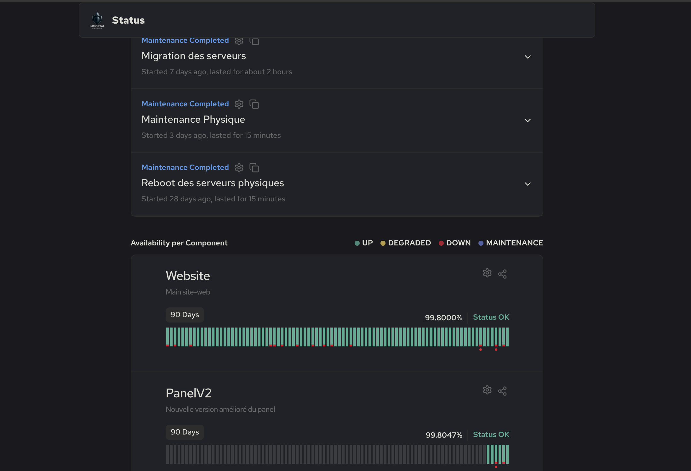
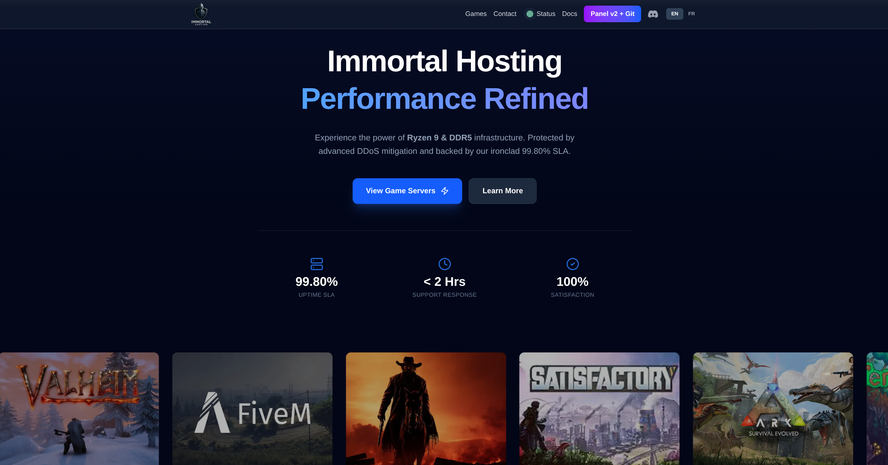

## Introduction
[Immortal Hosting](https://immortal.host)
 is not just a standard hosting provider; it is a sophisticated, self-managed infrastructure project designed to deliver high-performance application and game server hosting. Built on a foundation of modern DevOps practices, it leverages container orchestration, edge computing, and high-availability database clusters to ensure resilience and scalability.

Below is a technical resume of the architecture and technologies currently powering the **Immortal.host** ecosystem.

## Leadership & Architecture

As the **Founder and Lead Architect**, I am responsible for the end-to-end design, implementation, and maintenance of the entire Immortal Hosting ecosystem. My role encompasses:

* **Strategic Architecture:** Designing a cloud-agnostic, containerized infrastructure capable of scaling from a single node to a distributed cluster.
* **Full-Stack Development:** Spearheading the development of the frontend interfaces (Next.js) and integrating them with backend APIs and game server protocols.
* **DevSecOps Implementation:** Enforcing a security-first mindset by implementing Zero Trust networking, rootless containers, and centralized identity management.
* **Operational Leadership:** Managing the day-to-day operations, from database optimization to establishing the disaster recovery protocols that keep client data safe.

## Infrastructure & Orchestration

At the heart of Immortal Hosting lies a commitment to modern containerization and orchestration standards. Moving beyond simple bare-metal deployments, the infrastructure utilizes **Kubernetes** to manage workloads dynamically.

* **Kubernetes (K8s):** The core control plane for deploying and managing services. The environment utilizes custom YAML configurations to orchestrate complex deployments, ensuring that services like database clusters and control panels remain available and scalable.
* **Rootless Podman:** For enhanced security and granular container management, the infrastructure leverages Rootless Podman. This allows containers to run without root privileges, significantly reducing the attack surface while maintaining full OCI compliance.
* **Docker Compose:** Utilized for defining and running multi-container applications, ensuring reproducible development and production environments.

## CI/CD & Automation

Efficiency and reliability are driven by automated pipelines, ensuring that code moves from development to production seamlessly.

* **Managed Private Gitea:** The ecosystem is powered by a private, self-managed **Gitea** instance. This acts as the central hub for version control, hosting both application source code and Infrastructure-as-Code (IaC) repositories securely.

* **CI/CD Runners:** Integrated CI/CD runners are deployed to automate the software lifecycle. These runners handle testing, building, and deploying applications directly to the Kubernetes clusters, ensuring rapid iteration cycles and consistent delivery.

## Identity & Access Management

Security starts with identity. To protect the ecosystem, a unified authentication layer has been implemented across the board.

* **Authentik:** The infrastructure relies on **Authentik** as the central Identity Provider (IdP). This creates a seamless Single Sign-On (SSO) experience while enforcing strict access policies for all internal tools and panels.

## Database Architecture

Data integrity and availability are prioritized.

* **Backups:** S3 offsite backups are put in place for essential services, and a continuous backup policy is utilized to make sure even in the worst of disasters, the client's data is safe and sound.
* **Containerized Deployment:** Everything is deployed via Kubernetes, Podman, or Docker, allowing for seamless updates and resource isolation.

## Game Server Management

A primary function of the infrastructure is hosting low-latency, high-performance game servers.

* **Pelican Panel:** The infrastructure utilizes **Pelican Panel**, a modern, open-source game server management panel. This provides a centralized interface for deploying and managing game server instances.

* **GTA V / FiveM:** A key workload includes **FiveM** servers, optimized for GTA V roleplay and gaming communities. The network is tuned to handle the UDP traffic and real-time demands of multiplayer gaming.

## Networking & Security

The network stack is designed for speed, security, and ease of management, utilizing a modern reverse proxy architecture.

* **Caddy Web Server:** Unlike traditional heavyweights like Nginx or Apache, Immortal Hosting uses **Caddy** as its primary web server and reverse proxy. Caddy handles automatic HTTPS certification and routes traffic efficiently to internal backend services.
* **Cloudflare Integration:** The entire domain sits behind **Cloudflare**. This provides:
    * **DDoS Protection:** Shielding the infrastructure from Layer 3/4 and Layer 7 attacks.
    * **DNS Management:** Fast propagation and secure DNS resolution.
    * **Edge Caching:** Improving load times for web interfaces.
* **Zero Trust Principles:** By combining Caddy's strict routing with Cloudflare's trusted proxies, the origin servers are obfuscated and protected from direct internet exposure.

## Operations & Reliability

Maintaining high uptime requires vigilance and a proactive stance on support.

* **Continuous Monitoring:** The health of the infrastructure is tracked in real-time. Automated monitoring systems keep a pulse on server metrics, container health, and network latency.

* **Unbeaten Support:** Beyond the code, the human element is a core pillar. As the founder, I provide responsive, technical support, bridging the gap between complex hosting infrastructure and end-user needs.

## Web Development

Beyond infrastructure, the ecosystem supports custom web applications.

* **Next.js (React):** The frontend components (such as landing pages or status dashboards) are built using **Next.js**. This allows for a reactive, component-based UI, capable of handling dynamic content like live server stats or image carousels with multi-language support (English/French).

---

## Summary of Tech Stack

| Category | Technology |
| :--- | :--- |
| **Role** | **Founder & Lead Architect** |
| **Orchestration** | Kubernetes, Docker Compose, Rootless Podman |
| **DevOps / CI/CD** | Private Gitea + Runners |
| **Authentication** | Authentik (SSO/IdP) |
| **Database** | MariaDB HA Cluster |
| **Web Server** | Caddy (Reverse Proxy) |
| **Network Security** | Cloudflare (DDoS Protection, DNS) |
| **Game Control** | Pelican Panel |
| **Frontend** | Next.js (React) |

Immortal Hosting represents a full-stack engineering achievement, merging the complexities of game server hosting with enterprise-grade DevOps practices.