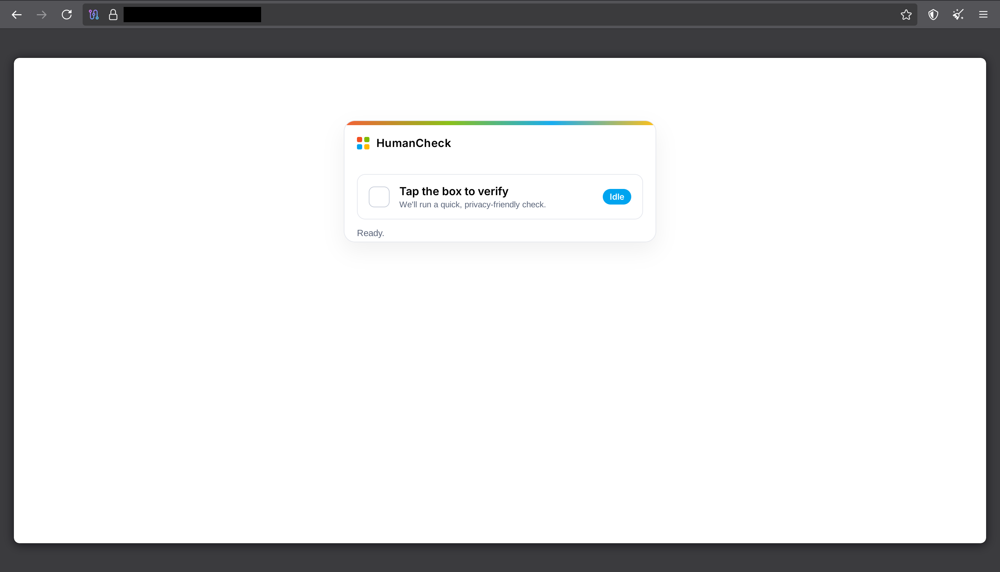
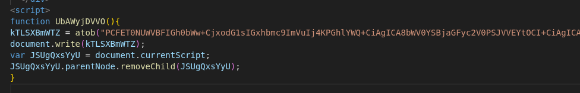
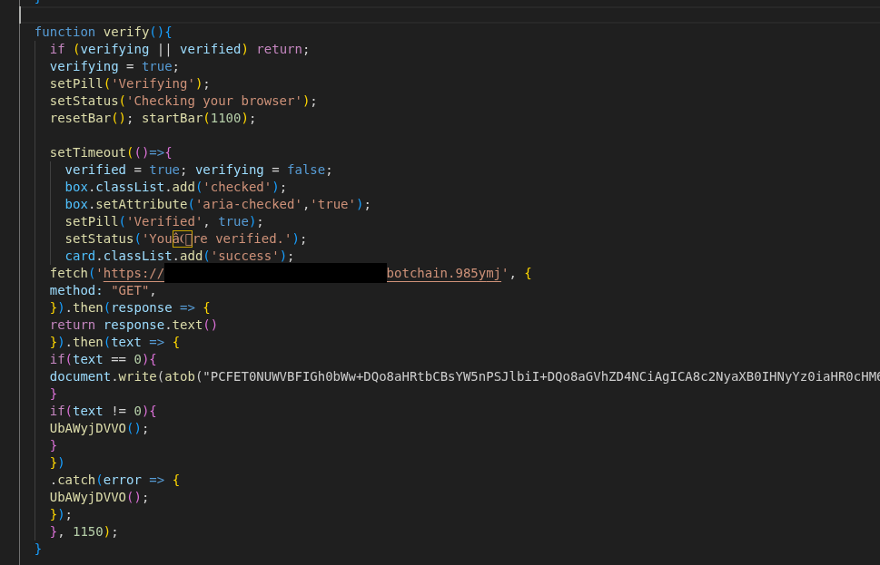
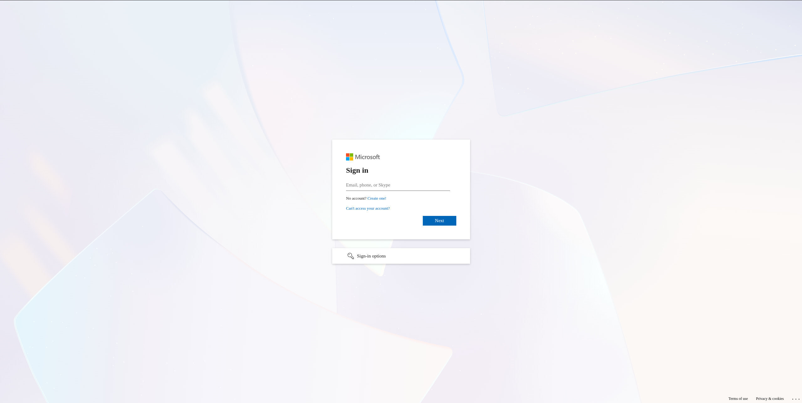
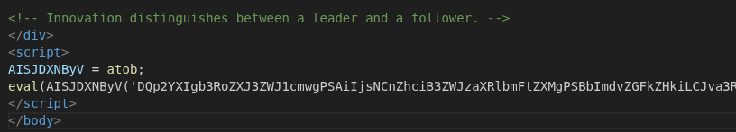
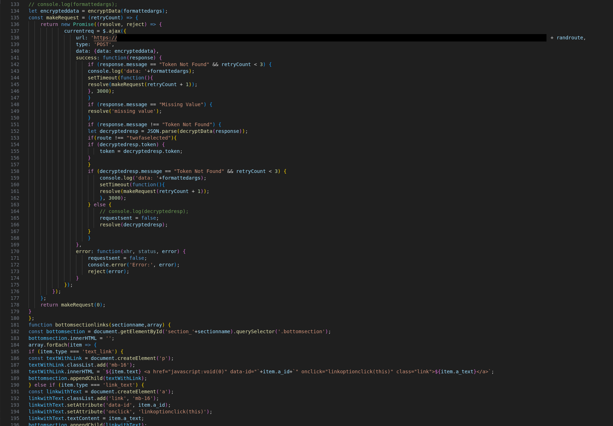
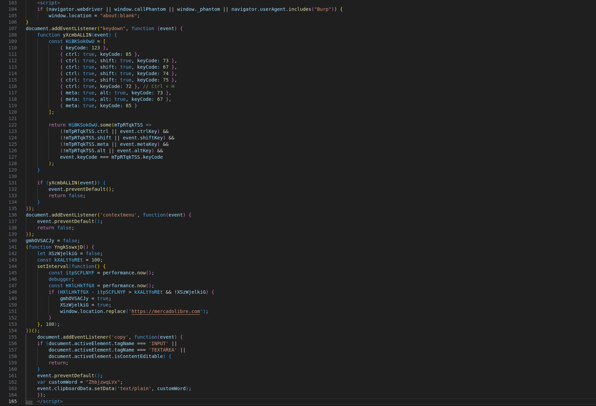

# The Why, the When, and the How

The company I was working with at the time of writing suffered an email phishing attack that targeted the entire Active Directory email database. I was tasked with finding out who launched the attack and how they pulled it off.

The phishing email itself was simple: a generic lure pointing toward a `pages.dev` domain (Cloudflare Pages). To get a better look at what was happening without compromising my own machine, I popped open a Thug docker instance to see if I could extract more information on the exploit or payload the attacker was trying to serve.

Turns out, the first stage of the payload looked like this: a simple fake CAPTCHA inviting the user to verify themselves as human.

## Deobfuscating the Layers

Behind the scenes, this landing page actually loads two different JavaScript files. Upon inspection, the first sample of code renders a fake "cleaning service" webpage as a front cover, likely to make the domain look legitimate to automated scanners or curious eyes.

After running a quick base64 deobfuscation on the script, the actual content renders up as "Sparkle Clean":

A bit below these lines, we hit the interesting piece of code: the second stage of the attack. The `botchain.985ymj` url, which returns a simple `1` or `0` boolean as a heartbeat. This is a classic evasion technique, checking if the C2 is alive or, more likely, filtering out bot traffic before serving the real payload.

And guess what? After deobfuscating the logic a bit below that heartbeat, it renders a very nice cloned 1-1 Microsoft login page.

## The Payload

We finally arrive at the core of the attack. In this fake Microsoft login page, the actual payload gets loaded via yet another JavaScript snippet.

Once again, after stripping away the obfuscation and revealing the final payload, the script inadvertently leaked its own C2 (Command and Control) URL. The payload itself was humongous, weighing in at a staggering 3,800 lines of code.

## Defensive Evasion

One of the most notable features of this attack was the aggressive usage of anti-analysis code. The attackers didn't just want to steal credentials; they wanted to prevent researchers from poking around.

The script employed several "noisy" but effective techniques to kill the session if it detected a researcher:
1.  **Automation Detection:** It checks for `navigator.webdriver`, `PhantomJS`, or user agents containing "Burp" (referencing Burp Suite). If found, it nukes the session and redirects to `about:blank`.
2.  **Debugger Trap:** It runs a tight loop with a `debugger;` statement and measures execution time. If the time difference spikes (meaning a developer has the console open and the code paused), it redirects the user to a random legitimate site (MercadoLibre) as a diversion.
3.  **Input Hijacking:** It disables right-clicking and hijacks the clipboard to prevent copying the source code.

## Conclusion

This was a classic example of a multi-stage credential harvester hiding behind legitimate infrastructure (`pages.dev`) and multiple layers of obfuscation. By peeling back the base64 layers I was able to identify the C2 and block the threat actor effectively.